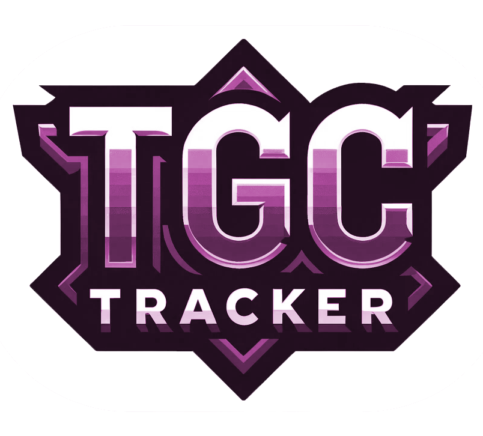

# Pokemon TCG Tracker

## Overview
The Pokemon TCG Tracker is a Vue.js web application designed for enthusiasts of the Pokémon Trading Card Game. It serves as a digital platform for users to build and track their personal Pokemon card collections. Integrating with the [pokemontcg.io](https://pokemontcg.io/) API and a custom API, the app provides an extensive database of Pokémon cards, allowing users to search, view, and manage their favorite cards with ease.

## Features
- **Card Search**: Utilize a powerful search feature to find cards by name, type, or set.
- **Personal Collection Management**: Add cards to your personal collection, manage them, and keep track of your favorites.
- **Wishlist**: Mark cards you wish to acquire and manage your wishlist.
- **User Authentication**: Secure user registration and login functionality.

## Technologies Used
- **Vue.js**: A progressive JavaScript framework used for building user interfaces.
- **Tailwind CSS**: A utility-first CSS framework for rapid UI development.
- **Axios**: A promise-based HTTP client for making HTTP requests.
- **Vuex**: A state management pattern and library for Vue.js applications.
- **Vue Router**: The official router for Vue.js to build single page applications.

## Demo
Check out the live demo of the app: [Pokemon TCG Tracker Demo](https://tgc-tracker.vercel.app/)

## API Used
Frontend interacts with a custom API for user data and card collection management. API details can be found here: [TGC-tracker-API](https://github.com/thomasnrggo/TGC-tracker-API)

## Getting Started
To run the Pokemon TCG Tracker locally:
1. Clone the repository.
2. Install dependencies with `npm install`.
3. Start the development server with `npm run serve`.

## Contributing
Contributions to the Pokemon TCG Tracker are welcome! Please read our contributing guidelines for more information.

## License
This project is licensed under the MIT License - see the [LICENSE.md](LICENSE.md) file for details.
